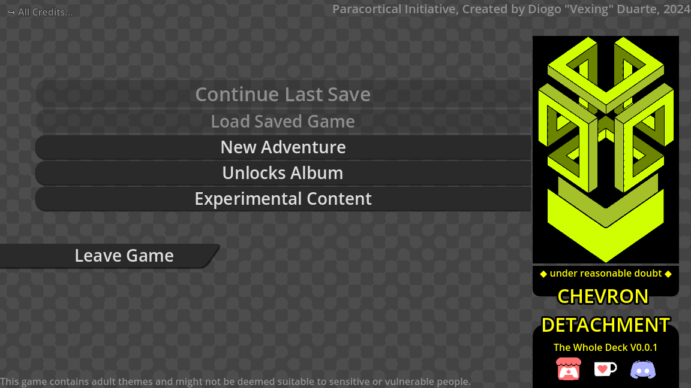
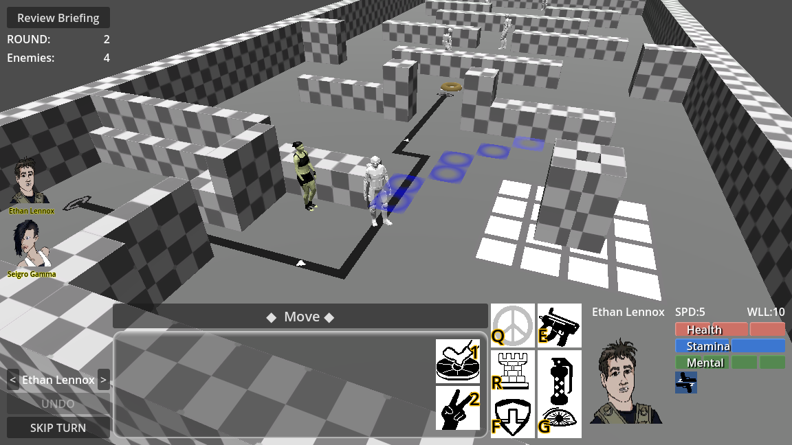

For Paracortical Initiative, 2025, Diogo "Theklo" Duarte

Other projects:
- [Bluesky for news on any progress I've done](https://bsky.app/profile/diogo-duarte.bsky.social)
- [Itchi.io for my most stable playable projects](https://diogo-duarte.itch.io/)
- [The Github for source codes and portfolio](https://github.com/Theklo-Teal)
- [Ko-fi is where I'll accept donations](https://ko-fi.com/paracortical)

Read "" for information on third-party assets.

# DESCRIPTION
A turn-based tactics combat Godot game with some light RPG elements.

Command four characters as they explore the strange government projects in underground military facilities.

Note that by the nature of not having a story well decided, different titles for this project are mentioned at different parts. The main working title is "Cross Pollinator" often shortened to "X-Poll". But "Chevron Detachment" is also used.

This is part of my collection of projects in indefinite hiatus. I release it publicly in case someone likes the ideas and wants to develop them further or volunteers to work with me on them.
See  for more information.

# THE CONCEPT
## The Plan

I've been considering this as my "main project", something to develop in the long term and monetize once a minimum viable product. It might be my most complex programming project to date.

The business model would be to have a base game for free, with all the gameplay features and a basic story included, much like shareware games. But then I would regularly create DLC with expansions to the campaign story, more combat locations and more equipment for characters, which would be purchased for cheap. The player would be free to select which stories and features they want to have in their experience without paying for what they find extraneous or not enjoyable.

Originally I was inspired by Portals of Phereon by Syvaron, where I thought that if a game this convoluted and with simple interactivity could still have a niche fanbased out of lore and art alone, then I could probably do something better.

I'm not confident in my art skills, but the plan was to develop the technical framework, get the coding done and pitch it to an aspiring artist that would fill this "skeleton" of a game with charismatic characters and locations. It could be the wholesome start of a small indie studio, who knows.

I think a lot of the appeal has to come from the character development, so the game would be very focused on the same 4 main characters which are persistent.
## The Gameplay

The project has diverged much from POP and I'm not considering adding much lewd/adult content at all anymore, apart from maybe a cutscene or hidden lore flavour. But I've mocked up systems for such idea. Maybe these systems could be recycled for other purposes in the future. See "Levels/Other/" folder.

At the end of the day, this project as become a lot of an attempt at being my opportunity to be an "auteur" much like Hideo Kojima is allowed to experiment with strange ideas in his projects.

The main spectacle of the game would be the XCOM inspired combat sections. I intended to have levels which are a sequence of rooms which have to be traversed until an objective is found or a puzzle is solved to enable to objective. For example collecting a quest item, rescuing a VIP or disabling some machine which requires the right combination of levers to be pulled. Eliminating all enemies alone isn't all that interesting, it needs a twist. I liked the parts of XCOM where you needed to eliminate the enemies before they killed all the civilians. We could have more of that kind of gameplay.

Between combat missions, XCOM has sort of "ant-farm" view of an headquarters where the player does simple base management. In my game the characters would be free to roam a military facility to collect lore, unlock more combat sections and talk to other characters. This would be like a metaphor or narrative representation of detective investigations. But I didn't intend to make it elaborate, but more as an incentive to explore the facility.

What these combat missions and the freeroam facility look like in practice would depend on the story and I've gone through several different iterations on the idea.

Akin to POP, I also thought of wedging some card game mechanics, maybe as part of how character interactions work. There could be a whole lore theme about how the main characters like to play cards an use card suits as their codenames.
## The Aesthetic

The story is supposed to be like a spy thriller with alien things going on that are incomprehensible or uncanny. Yet it needs to be grounded with relatively hard sci-fi elements and all factions are highly competent agents. There are a couple of allowed elements with suspension of disbelief, from which then all other sci-fi concepts logically follow, but these base elements need to be constrained and reduced. There aren't actual aliens, but rather a faction of crypto-terrestrials, The Agarthians, which use psy-ops to hide their existence. Their activity would originate events of the style of UFO contact and Men In Black stories. The player encounters and engages mostly with other common humans, but because they are investigating the exotic artifacts from Agarthians, you'll stumble into these as they try to interfere.

I've been also considering the big "common human" faction to be like the SCP Foundation, where they collect Agarthian technology for reverse-engineering and investigation, but that might not fit very well with other elements of the story, in particular because the artifacts can't have too much of magical powers.

Some of the disbelief elements include the "DUMB", the existence of an extensive military underground network connecting all points of interest in the story. The Agarthians have technology based on vitalism and the Noosphere. Some hints were taken from the STALKER series of games on the mechanics of this magical element. A lot of genetic engineering is also involved to an exaggerated level, putting the story technically in the biopunk subgenre. I also considered having anti-gravity and teleportation elements, but at later development I realized these make the lore cumbersome and prone to plot holes. The idea might be recycled in the future.

Maybe the player would be fighting in crazy science labs where the Agarthian technology is studied or imitated. Much like STALKER gets the player into underground labs with weird giant machines.

Apart from these descriptions, I would like to leave the proper writing and direction of the story and the art style to another artist I intended to have work with me eventually. I have written much as a placeholder to help me make decisions in gameplay and presentation, but I can't figure out coherent ideas.

---

# INSTALLATION
Put these files in your Godot projects folder and search for it in project manager of Godot! Compatible with Godot 4.5.

Some copyrighted license requiring music might be have been referred, but the files were removed in the public release of the project. That music was meant as inspirational mood boarding.

The removal of those song might have broken some minor parts of the project.

# USAGE
You can press "Run Project" in Godot to load from the start menu, but starting a new game attempts to switch to a scene in the Freeroaming mode of the game which is underdeveloped.

A gameplay demonstration will execute properly by "Run Current Scene" while having "Levels/Tactics/tactics_test.tscn" open in the editor.

Other scenes ("Levels/") and menus ("Menus/") can be tested in a similar way. The folder "mockups/" includes small scale experiments on mechanics and non-functional UI.

In the "misc/" folder you can find some explanations of how the project is designed. For example, "Chevron_Detachment_Architecture.png" let's you know the interactions that make character control and the quest/interaction system work.

# WHY_IN_HIATUS
Items, equipment and character abilities might need some work and fine-tuning as the gameplay is better defined, but they didn't seem very hard to implement so far.

The biggest showstopper has been NPC AI during combat. It's a form utility AI. I thought it would be simple. Just test positions within the field, by simulating all attacks to all characters, then picking the most effective one. But when I tried implementing this nothing worked in a plausibly smart way. NPCs move restlessly and inconsistently. There are plenty of ideas on how to fix this, but which combination of ideas would works as desired I don't know. It's pretty hard to test if AI is doing what you want, even if it looks right sometimes.

The project includes a rudimentary level editor as a custom Godot plugin ("addons/Tac_Map_Gen"). It barely works and doesn't do everything I want it to. Plugin development is poorly documented and can produce a lot of mess.
You can make basic levels or tactical grids with it, where each tile includes individual 3D objects as walls and individual sprites for the floor. But it should have optimizations like auto-tiling of walls. The floor could probably be a single sprite which texture is edited.

The most annoying thing is allowing for levels to have multiple tactical grid objects connected together and multiple height platforms the characters could climb up of drop from. These features seem very complicated to implement.
